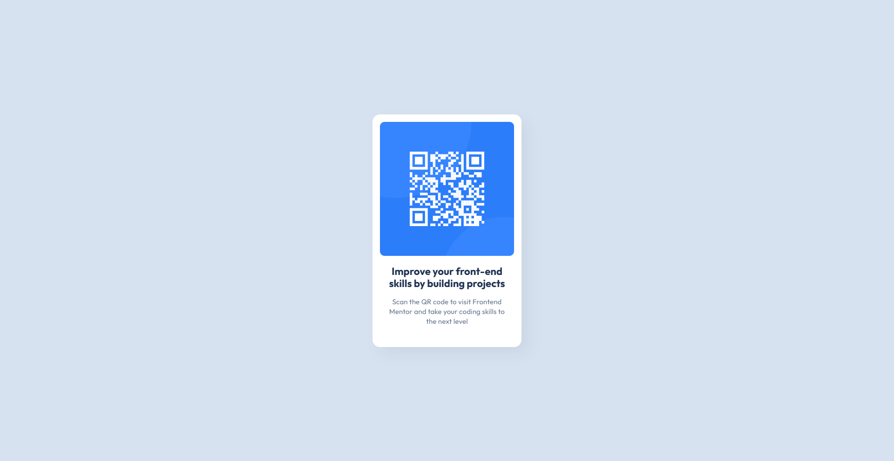

# Frontend Mentor - QR code component solution

This is a solution to the
[QR code component challenge on Frontend Mentor](https://www.frontendmentor.io/challenges/qr-code-component-iux_sIO_H).
Frontend Mentor challenges help you improve your coding
skills by building realistic projects.

## Table of contents

-   [Overview](#overview)
    -   [Screenshot](#screenshot)
    -   [Links](#links)
-   [My process](#my-process)
    -   [Built with](#built-with)
    -   [What I learned](#what-i-learned)
    -   [Continued development](#continued-development)
-   [Author](#author)
-   [Acknowledgments](#acknowledgments)

**Note: Delete this note and update the table of contents
based on what sections you keep.**

## Overview

### Screenshot

#### Desktop View



#### Mobile View


### Links

-   Solution URL:
    [https://github.com/maikel-mattiu/frontendmentor-qr-code-challange](https://github.com/maikel-mattiu/frontendmentor-qr-code-challange)
-   Live Site URL:
    [https://maikel-mattiu.github.io/frontendmentor-qr-code-challange](https://maikel-mattiu.github.io/frontendmentor-qr-code-challange)

## My process

### Built with

-   Semantic HTML5 markup
-   CSS custom properties
-   Flexbox
-   CSS Grid
-   Mobile-first workflow

### What I learned

While working on this project, I didn't want to work with
fixed values since I was aiming for responsiveness and
flexibility. This means moving of **px** to **rem**:

```css
#card_wrapper {
	padding: 1rem;
}
```

And also using using the **min()** function in CSS to apply
the smaller value to the elements width:

```css
#card_wrapper {
	width: min(20rem, 90vw);
}
```

### Continued development

I still believe I have a lot of brushing up to do regarding
certain areas and topics in frontend development especially
with:

-   HTML Markdown structuring
-   Layouts
-   Transitions
-   Animations
-   Responsiveness
-   And some modern CSS features and conventions for optimal
    page performance.

## Author

-   Frontend Mentor -
    [@maikel-mattiu](https://www.frontendmentor.io/profile/maikel-mattiu)
-   X/Twitter - [@mich_nduka](https://x.com/mich_nduka/)

## Acknowledgments

I would like to appreciate the Frontend Mentor team for the
resources that helps not just me alone but also the
thousands of students that aim to be great frontend
developer. Thank you for all you do 😁.
